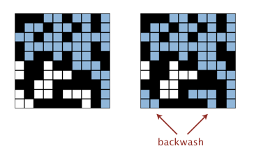

# Union-Find Application

This application is derived from a assignment of Algorithms - Princeton on Coursera.   
Assignment specification refers to: [percolation](http://coursera.cs.princeton.edu/algs4/assignments/percolation.html)

## Percolation

Union-find have lots of applications, such as social networks, computer networks. metallic sites in a composite system, and transistors or conductors in industry world.

We will focus on the application of _percolation system._ Its principle is quite like the abstraction of _filter_ or _conductor._

> **Percolation.** Given a composite systems comprised of randomly distributed insulating and metallic materials: what fraction of the materials need to be metallic so that the composite system is an electrical conductor? Given a porous landscape with water on the surface \(or oil below\), under what conditions will the water be able to drain through to the bottom \(or the oil to gush through to the surface\)? Scientists have defined an abstract process known as _percolation_ to model such situations.

## Model Design


Given the definition of percolation, we model this system by:

* _`N-by-N`_ grid of sites;
* Each site will be open\(empty/full\) or block;
* System percolated when bottom are connected to top by open sites.   



```java
public class Percolation {
    public Percolation(int n)                //create n-by-n gird, with all sties blocked
    public void open(int row, int col)       //uniformly open random site(row, col) if it is not open
    public boolean isOpen(int row, int col)  //is site(row, col) open?
    public boolean isFull(int row, int col)  //is site(row, col) full?
    public int numberofOpenSites()           //number of open sites
    public boolean percolates()              //does the system percolate?
}
```



After having the API of percolation system, lets ask some questions to myself.

### What about these sites and procedure?

All sites will initially be blocked site and then uniformly  become random open sites via method call `open()`. Adjacent open sites will obviously connect to each other. Whether these open sites is  FULL or NOT depends on whether, together, these adjacent sites will connect to the TOP. If existing any group of open sites is connected to both TOP and BOTTOM, system will then become percolated.

### How to arrange these sites and trace the status of each site?

Use **Weighted Union-Find** data structure to arrange sites due to the connected property of adjacent open sites. It is also a wise choice to use array such as `isOpenSite[N * N]` to record status of each site.

### How to identify system percolated?

We get 3 different schemes to implement identification of percolated:

1. Check iteratively
2. Virtual sites
3. Tracking connected status of  Top & Bottom

Details of 3 different implementation will discuss at [next](union-find-application.md#algorithm-analysis)

## Algorithm Analysis

Primarily, we want to make sure that obviously, two MOST crucial parts of whatever algorithm is `open(row, col)` and  `isFull(row, col)`, one to open a site AND construct the connectivity of neighbouring open sites with `union()`, the other to identify, an additional connectivity status of system, `isFull(row, col)`,  which is a essential bedrock of identifying whether is percolated.

Because `open(row, col)` would be more sophisticated due to connectivity construction, we will analyze its elementary elements first.



1. Judging whether \(row, col\) is an open site
2. Set \(row, col\) to be opened if possible
3. To build a new connectivity, union \(row, col\) with its adjacent if opened 
4. \*Keep maintaining the newly merged connectivity from several unions.



Why would  i say `isFull(row, col)` is a bedrock of identifying whether is percolated?   
Because it not only defines the function of itself,  but also is the prerequisite of successful percolation, which means there must has been a connected component connecting to the TOP of _n-by-n_ grids if system percolated.

In which case, we acquire 3  different implementations of identifying successful percolation according to different ways of implementing `isFull(row, col)` 

### Check iteratively

* To identify `isFull(row, col)`, check whether \(row, col\) is connected with each possibly opened site on the TOP.
* To identify `percolated()`, iteratively check connectivity of sites on the BOTTOM with each possibly opened site on the TOP.


Undoubtedly this assumed implementation is not efficient. For n-by-n grids the percolates\(\) may take `n^2logn` in the worst case.


### Virtual sites

Checking iteratively is costly, so we'd like to carry out a new implementation without check connectivity frequently.

A new _n-by-n_ grids with virtual sites:  Respectively, all OPENED top or bottom row sites will initially to be in the same connected component with virtual top or bottom sites.


* To identify `isFull(row, col)`, only need check whether \(row, col\) is connected to top virtual site.
* To identify `percolates()`, check whether the virtual bottom is connected to top virtual site.

At first glance, this is a big improvement relative to check iteratively, only taking logarithm time for both methods.


However, there will be a subtle bug in `isFull(row, col)`, which is called _**backwash**_.


#### Backwash



```java
import edu.princeton.cs.algs4.WeightedQuickUnionUF;
public class Percolation {
    private WeightedQuickUnionUF site;
    private int size;
    private int nOS;
    private boolean[] isOpenStite;
    
    public boolean isFull(int row, int col) {
        validate(row, col);              //validate input range
        int index = xyToid(row, col);    //convert n-by-n grids to one dimensional array index
        return site.connected(index, 0); //Backwash happens here
    }
    
    public boolean percolates() {
        return site.connected(0, size * size + 1);    //are both virtual sites in the same connected component?
    }
}
```





It is not difficult to find out the reason of backwash. The backwash problem will clearly happen after successful percolation. This is because: 

> **After system percolated, the virtual top and bottom are connected, and in the SAME connected component. Then the newly opened site on the bottom row, with other connected sites, will join in that connected component of percolation due to its property of automatically connecting with bottom virtual site.**

#### Debug

To avoid backwash, I create another instance variable `WeightedQuickUnionUF connectToTop` to: 

* Similarly arrange sites and their connectivity update, but differently,  getting rid of ~~virtual bottom site~~.
* Be used by `isFull(row, col)` as conditional identification of connection to the TOP .
* Guarantee that no backwash bug would happen in isFull\(row, col\) via virtual bottom site.

One things that not change is i still use the previous WeightedQuickUnionUF sites to be the conditional identification of successful percolation, like the partial core code shows below. 



```java
import edu.princeton.cs.algs4.WeightedQuickUnionUF;
public class Percolation {
    /* Memory used 17n^2 + ～ */
    private WeightedQuickUnionUF site;
    private int size;
    private int nOS;
    private boolean[] isOpenStite;
    private WeightedQuickUnionUF connectToTop;
    
    public boolean isFull(int row, int col) {
        validate(row, col);              //validate input range
        int index = xyToid(row, col);    //convert n-by-n grids to one dimensional array index
        return (isOpen(row, col) && connectToTop.connected(index, 0));
    }
    
    public boolean percolates() {
        return site.connected(0, size * size + 1);    //are virtual sites in the same connected component?
    }
}
```



For now, this subtle bug has been solved by subtle changes.


But don't you think it is sort of wasting memory? Both WeightedQuickUnionUf are doing the SAME thing at most time. All we want to do is simply keep tracking connectivity to the TOP of different connected components.  
Sure enough, my the implementation so far failed to pass the bonus test of memory use, which is expected to be `11n^2`. So there must be a better way.


## Improvement

### Tracking connected status of  Top & Bottom

Remember the key that 

> All we want to do is simply keep tracking connectivity to the Top of different connected components.

The answer of further optimization start to become clear and easier:

* Throw away secondly memory wasting WeightedQuickUnionUf
* Replace it with something easier to record and trace status of connectivity to Top.

Similarly, _array_, such as the array tracking opened/blocked status of **each site**,  could take that job.  
The ONLY different is that this new _array_ will track the connected to Top/Bottom status of **each connected component**, but might NOT ~~each site~~.


At fist, i carried out a 2-dimensional `boolean[n*n][2]` to keep tracking the status of connectivity to Top/Bottom for each potential component identifier, expecting a improvement in both timing and memory. However, this turns out to use approximately `49n^2 + ～` memory, nearly **3 times worse memory use** and **double time costing** than before. 


After analyzing, the problem here is the property of 2-dimensional array.

* Creating 2-dimensional array of size _n-by-n_ grids, we will  `8n^2` bytes array reference and `16n^2` bytes subarray overhead instead of total `2n^2 + 20` bytes memory of one WeightedQuickUnionUf object
* The order of growth of  initiliazing this 2-dimensional array will be `n^2 + 2n^2`, i guess?


Accordingly, we decide to use two 1-dimensional boolean type array  `connectTop[]` and `connectBottom[],` which effectively use only `11n^2 + ～` memory.


#### Complete code implementation



```java
import edu.princeton.cs.algs4.WeightedQuickUnionUF;
public class Percolation {
    /* Memory used 11n^2 + ～ */
    private boolean[] open;        //blocked: false, open: true 
    private boolean[] connectTop;
    private boolean[] connectBottom;
    private int N;        //size of N-by-N grids
    private WeightedQuickUnionUF uf;
    private boolean percolateFlag;
    private int nOS;

    public Percolation(int N)  {             // create N-by-N grid, with all sites blocked
        if (N <= 0) {
            throw new IllegalArgumentException("N must be bigger than 0");
        }
        this.N = N;
        uf = new WeightedQuickUnionUF(N*N);
        open = new boolean[N*N];
        connectTop = new boolean[N*N];
        connectBottom = new boolean[N*N];
    
        for (int i = 0; i < N*N; i++) {
            open[i] = false;
            connectTop[i] = false;
            connectBottom[i] = false;
        }
        percolateFlag = false;
    }
    
    public void open(int i, int j)  {        // open site (row i, column j) if it is not open already
        validateIJ(i, j);
        int index = xyTo1D(i, j);
        open[index] = true;  //open
        nOS++;
        boolean top = false;
        boolean bottom = false;
    
        if (i < N && open[index+N]) {
            if (connectTop[uf.find(index+N)]) {
                top = true;
            }
            if (connectBottom[uf.find(index+N)]) {
                bottom = true;
            }
            uf.union(index, index+N);
        }
        if (i > 1 && open[index-N]) {
            if (connectTop[uf.find(index-N)]) {
                top = true;
            }
            if (connectBottom[uf.find(index-N)]) {
                bottom = true;
            }
            uf.union(index, index-N);
        }
        if (j < N && open[index+1]) {
            if (connectTop[uf.find(index+1)]) {
                top = true;
            }
            if (connectBottom[uf.find(index+1)]) {
                bottom = true;
            }
            uf.union(index, index+1);
        }
        if (j > 1 && open[index-1]) {
            if (connectTop[uf.find(index-1)]) {
                top = true;
            }
            if (connectBottom[uf.find(index-1)]) {
                bottom = true;
            }
            uf.union(index, index-1);
        }
        if(i == 1) {
            top = true;
        }
        if(i == N){
            bottom = true;
        }
        connectTop[uf.find(index)] = top;
        connectBottom[uf.find(index)] = bottom;
        if( top &&  bottom) {
            percolateFlag = true;
        }
    }
    
    private int xyTo1D(int i, int j) {
        validateIJ(i, j);
        return j + (i-1) * N -1;
    }
    
    private void validateIJ(int i, int j) {
        if (!(i >= 1 && i <= N && j >= 1 && j <= N)) {
            throw new IndexOutOfBoundsException("Index is not betwwen 1 and N");
        }
    }
    
    public boolean isOpen(int i, int j) {   
        validateIJ(i, j);
        return open[xyTo1D(i, j)];
    }
    
    /*A full site is an open site that can be connected to an open site in the top row
     * via a chain of neighboring (left, right, up, down) open sites.
     */
    public boolean isFull(int i, int j) {   
        validateIJ(i, j);
        return connectTop[uf.find(xyTo1D(i, j))];
    }
    
    public boolean percolates()  {   
        return percolateFlag;
    }
    
    public int numberOfOpenSites() { 
        return nOS;
    }
}
```



